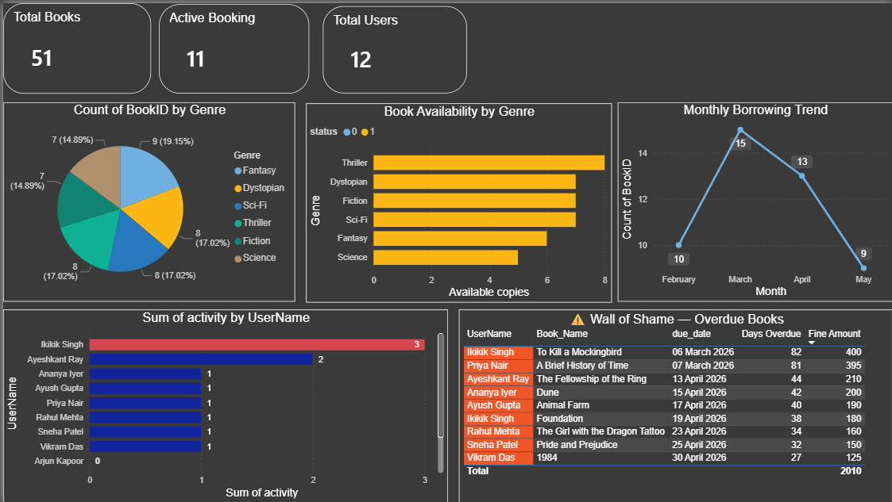

# 📚 Library Management System

A Python-based Library Management System that uses MySQL as the backend database. It allows librarians to manage books, users, borrowing, and returns through a simple command-line interface — complete with due date tracking, overdue fine calculation, transaction safety, and a Power BI analytics dashboard.

---

## Features

- Display library rules on startup
- View all available books
- Insert new books into the library
- Delete books from the collection
- Search books by name, author, or genre
- Borrow books (with a limit of 3 books per user)
- Due date displayed automatically on every borrow
- Return borrowed books with full overdue fine calculation
- 3-tier overdue system: on time → grace period warning → fine with amount
- Grace period of 2 days before fines are applied
- Return date recorded in DB — full borrowing history preserved for analytics
- Auto-registration for new users on first borrow — seamlessly continues to borrowing without re-entering ID
- Smart identity lookup — login by User ID or Name during borrow and return
- Duplicate name handling — shows list with IDs if multiple users share the same name
- Borrowed books list with due dates displayed before returning
- Transaction rollback on database errors — tables never get out of sync
- Safe connection teardown on exit
- Power BI dashboard with live MySQL connection for real-time analytics

---

## Tech Stack

| Layer | Technology |
|---|---|
| Language | Python 3 |
| Database | MySQL |
| Connector | mysql-connector-python |
| Environment Management | python-dotenv |
| Analytics | Power BI (live MySQL connection) |

---

## Prerequisites

- Python 3.x
- MySQL Server
- `mysql-connector-python` package
- `python-dotenv` package

Install via pip:

```bash
pip install mysql-connector-python python-dotenv
```

---

## Database Setup

> ⚠️ The original database was lost during transfer. Recreate it manually using the schema below.

Connect to your MySQL server and run the following SQL to set up the required schema:

```sql
CREATE DATABASE projects;
USE projects;

-- Stores library rules displayed on startup
CREATE TABLE library_rules (
    rule_id INT AUTO_INCREMENT PRIMARY KEY,
    rule_description VARCHAR(255) NOT NULL
);

-- Stores all books in the library
CREATE TABLE library_books (
    BookID INT PRIMARY KEY,
    Book_Name VARCHAR(100) NOT NULL,
    Genre VARCHAR(50) NOT NULL,
    Author VARCHAR(100) NOT NULL,
    status INT DEFAULT 1  -- 1 = Available, 0 = Borrowed
);

-- Stores registered users
CREATE TABLE users (
    UserID INT PRIMARY KEY AUTO_INCREMENT,
    UserName VARCHAR(100) NOT NULL,
    activity INT DEFAULT 0  -- Tracks number of books currently borrowed (max 3)
);

-- Tracks all borrowings (active and historical)
CREATE TABLE booking (
    BookingID INT AUTO_INCREMENT PRIMARY KEY,
    UserID INT NOT NULL,
    BookID INT NOT NULL,
    borrow_date DATE NOT NULL,
    due_date DATE NOT NULL,
    return_date DATE DEFAULT NULL,  -- NULL = still borrowed, DATE = returned
    FOREIGN KEY (UserID) REFERENCES users(UserID),
    FOREIGN KEY (BookID) REFERENCES library_books(BookID)
);
```

### Sample Data

```sql
INSERT INTO library_rules (rule_description) VALUES
('Maximum of 3 books can be borrowed per user.'),
('Standard borrowing period is 14 days.'),
('A fine of ₹5 per day will be charged for each day after the grace period.'),
('A grace period of 2 days is allowed after the due date before any fine is applied.');

INSERT INTO library_books (BookID, Book_Name, Genre, Author) VALUES
(101, 'The Hobbit', 'Fantasy', 'J.R.R. Tolkien'),
(102, 'Dune', 'Sci-Fi', 'Frank Herbert');

INSERT INTO users (UserName) VALUES ('Alice');
```

---

## Configuration

Database credentials are managed via a `.env` file to keep sensitive information out of the source code.

### 1. Copy the example env file

```bash
cp .env.example .env
```

### 2. Fill in your credentials in `.env`

```
DB_HOST=localhost
DB_USER=root
DB_PASSWORD=your_mysql_password
DB_NAME=projects
```

> ⚠️ Never share or commit your `.env` file. It is already listed in `.gitignore`.

---

## How to Run

```bash
python Library_Management.py
```

On launch, the program will:

1. Connect to the MySQL database
2. Display the library rules
3. Show the main menu

---

## Menu Options

| Option | Action |
|---|---|
| 1 | Display all books |
| 2 | Insert a new book |
| 3 | Delete a book |
| 4 | Search for a book |
| 5 | Borrow a book |
| 6 | Return a book |
| 7 | Exit |

---

## Overdue Fine System

When returning a book, the system automatically calculates how long it was held and responds with one of three outcomes:

| Condition | Response |
|---|---|
| Returned within 14 days | ✅ "Returned on time! Thank you." |
| 1–2 days overdue | ⚠️ Grace period warning, no fine |
| 3+ days overdue | ❌ Fine displayed — ₹5 per day after the 2-day grace period |

**Fine formula:** `fine = (days_overdue - 2) × ₹5`

The librarian is informed of the fine amount and collects it manually. The return is processed normally regardless.

---

## Power BI Dashboard

The project includes a Power BI dashboard connected live to the MySQL database, providing real-time library analytics.

### Visuals included

| Chart | Description |
|---|---|
| Total Books | KPI card — total books in the system |
| Active Bookings | KPI card — books currently borrowed |
| Total Users | KPI card — registered users |
| Count of Books by Genre | Pie chart — genre distribution across the library |
| Book Availability by Genre | Stacked bar — available vs borrowed per genre |
| Monthly Borrowing Trend | Line chart — borrowing activity across months |
| User Activity | Bar chart — books currently borrowed per user |
| Wall of Shame | Table — overdue books with days overdue and fine amount |

### Dashboard preview



---

## Notes

- A user can borrow a maximum of 3 books at a time.
- If a user is not found during borrowing, they are prompted to register and immediately continue to borrow — no need to re-enter their ID.
- Book status is automatically updated on borrow (`0`) and return (`1`).
- Invalid menu choices loop back to the menu directly without asking "Do you wish to continue".
- Both borrow and return accept User ID or Name as input.
- If multiple users share the same name, a list is displayed with IDs to pick from.
- Borrowed books with due dates are displayed before asking which book to return.
- `status` and `activity` default values are handled at the database level.
- `UserID` is auto-incremented by MySQL — no manual ID entry needed for new users.
- All database transactions are wrapped in `try/except` with `con.rollback()` on failure — tables never get out of sync.
- Cursor and connection are safely closed on both exit paths (menu option 7 and 'n' prompt).
- `return_date` is stored in the booking table — historical borrowing data is never deleted, keeping Power BI trends accurate over time.

---

## Recent Changes

| Area | Change |
|---|---|
| 🔐 Security | Removed hardcoded DB credentials — moved to `.env` file using `python-dotenv` |
| 🛡️ Git Safety | Added `.gitignore` to prevent `.env` from being pushed to GitHub |
| 🔁 UX Flow | New users are registered and immediately proceed to borrow without re-entering their ID |
| 🧠 Memory | Replaced all recursive `menu()` and `borrow()` calls with iterative `while True` loops |
| 🐛 Bug Fix | Fixed `UnboundLocalError` scope bug in `borrow()` function |
| 🗄️ DB Cleanup | Renamed tables `users1` → `users` and `booking1` → `booking` |
| 🔒 SQL Security | Replaced all string-formatted queries with parameterized `%s` queries |
| ✅ Return Validation | Return now checks booking table to verify user actually borrowed the book |
| 🎯 Invalid Choice UX | Invalid menu input now loops back directly without prompting "Do you wish to continue" |
| 🔑 Smart Login | Borrow and Return now accept User ID or Name as input |
| 👥 Duplicate Name Handling | Shows list with IDs if multiple users share the same name |
| 🗂️ DB Defaults | `status` and `activity` defaults moved to SQL schema; `UserID` is now `AUTO_INCREMENT` |
| 📋 Borrowed Books Display | Return function now shows currently borrowed books with due dates before asking which to return |
| 🧹 Input Sanitization | Added `.strip()` to all identity inputs to handle accidental whitespace |
| ⏰ Temporal Data | Added `borrow_date` and `due_date` to booking table — calculated once on borrow and stored |
| 💰 Fine System | 3-tier overdue logic: on time / grace period warning / fine at ₹5 per day after grace |
| 🔁 Code Refactor | Flattened `borrow()` and `Return()` into unified Step 1 (identity resolution) + Step 2 (transaction) pipelines |
| 🛡️ DB Safety | Wrapped all transactions in `try/except Exception` with `con.rollback()` on failure |
| 🔌 Connection Cleanup | `cur.close()` and `con.close()` called safely on both exit paths |
| 🗃️ History Preservation | Replaced `DELETE FROM booking` with `UPDATE booking SET return_date` — full borrowing history retained for Power BI |
| 📊 Power BI Integration | Live MySQL dashboard with genre charts, borrowing trends, user activity, and Wall of Shame overdue tracker |

---

## Roadmap

- [X] Refactor Registration UX (smooth new user → borrow flow)
- [X] Memory Optimization (removed recursion, `while True` loop)
- [X] Scope Bug Fix
- [X] Data Security (`.env` for DB credentials)
- [X] Strict Return Validation (verify user actually borrowed the book)
- [X] Parameterized Queries (prevent SQL injection)
- [X] Invalid Choice UX Fix (continue on invalid input)
- [X] Smart ID/Name Lookup (borrow + return)
- [X] Duplicate Name Handling
- [X] Auto-increment UserID + SQL DEFAULT values
- [X] Input Sanitization (`.strip()`)
- [X] Temporal Data (track 14-day borrow due dates + overdue fine system)
- [X] Code Refactor (unified Step 1 + Step 2 pipeline in borrow and return)
- [X] Transaction Safety (`try/except` + `rollback`)
- [X] Safe Connection Teardown on exit
- [X] History Preservation (`return_date` — no data loss on return)
- [X] Power BI Integration (live dashboard with genre, trend, activity, and overdue analytics)

---

## Project Structure

```
library-management/
│
├── Library_Management.py           # Main application file
├── Library_Management_Dashboard.pbix  # Power BI dashboard file
├── dashboard.png                   # Dashboard preview image
├── .env                            # Your local credentials (never commit this)
├── .env.example                    # Template for environment variables
├── .gitignore                      # Ensures .env is never pushed to GitHub
└── README.md
```

---

## Author

**Ayeshkant Ray** — [@Calxile](https://github.com/Calxile)
